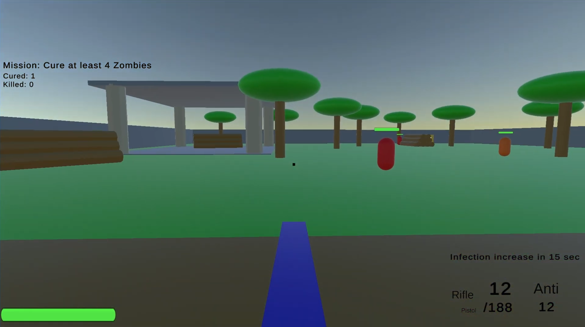
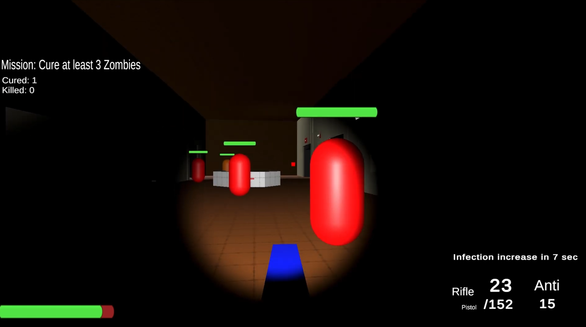
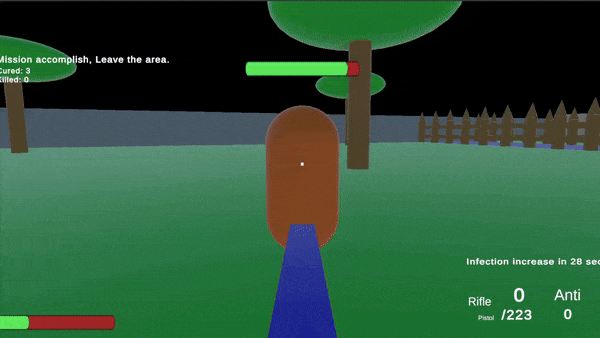
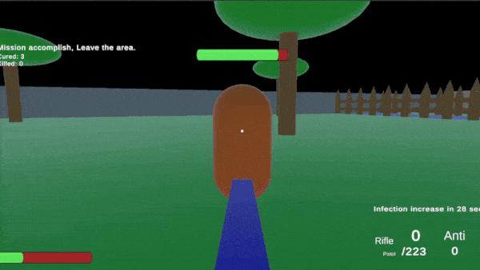
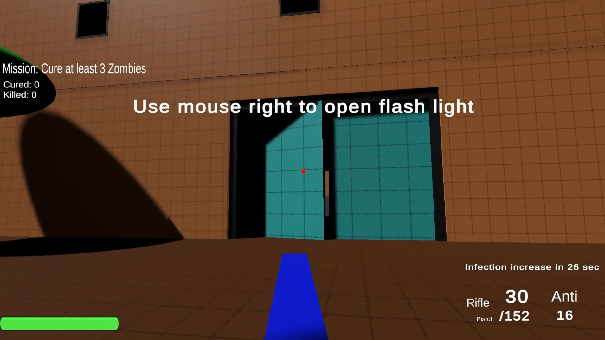
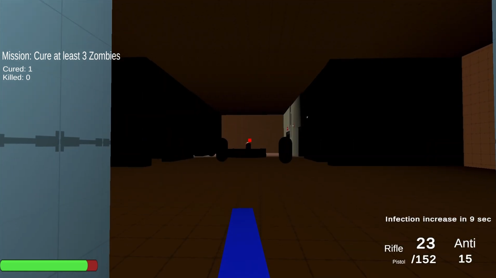
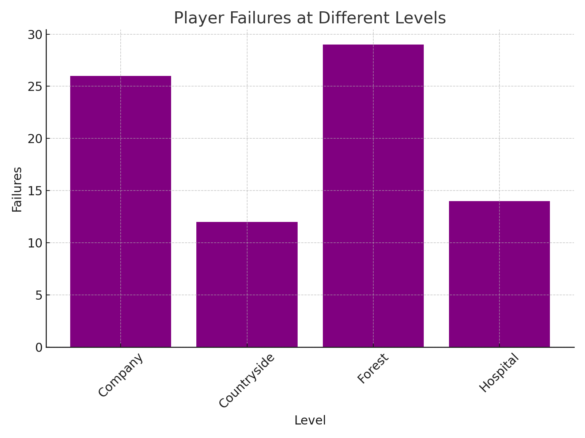
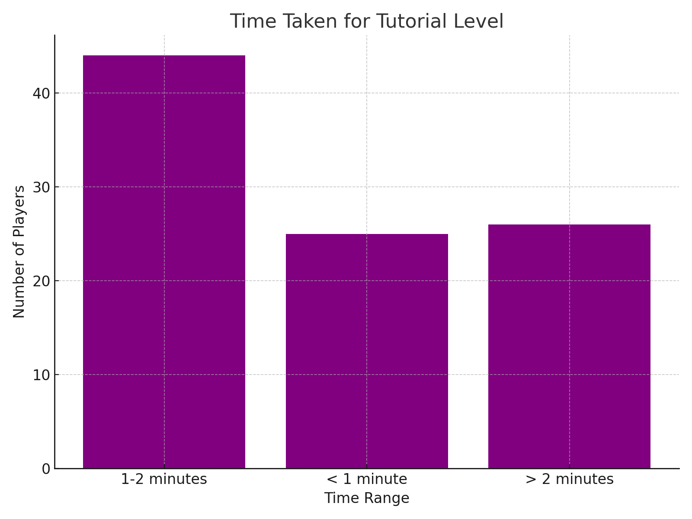
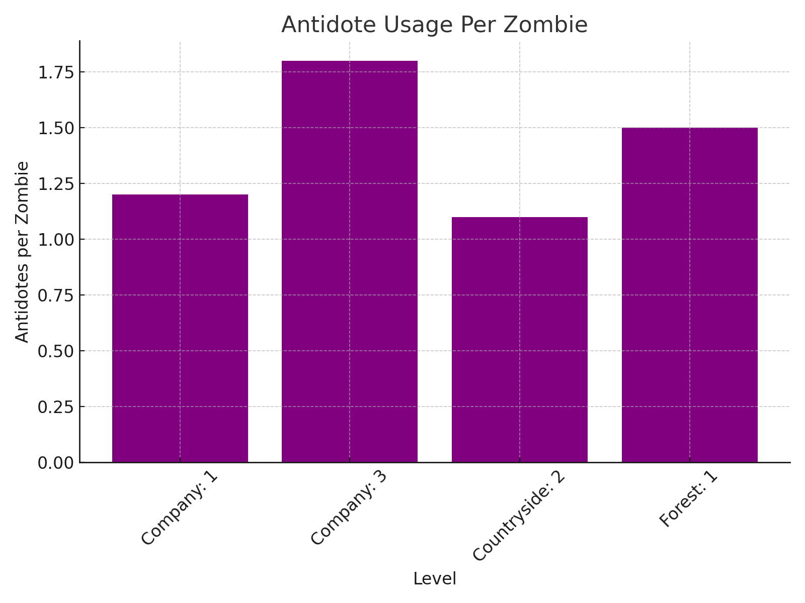

  <h2 align="center">The Curers</h2>
  

    <a href="https://github.com/havent-invented"><strong>Maksim Siniukov</strong></a>*
    ·  
    <strong>Peng Han</strong>
    ·
    <strong>Yubo Di</strong>
    ·
    <strong>Zhenjia Li</strong>
    ·
    <strong>Weinan Zhou</strong>
    ·
    <strong>Minghui Yang</strong>
     
    University of Southern California
     
    *Team Captain
     

  

## Game Introduction

### Logline
Our game is a level-by-level FPS game with infection and cure mechanisms.

<!-- ### Player Goals / Win Conditions -->
Clear all levels before running out of resources; in each level, cure enough zombies.
### Gameplay

  
  

Gameplay videos are shown in Game Videos section

### Game Description
**The Curers** is a fast-paced, level-based FPS blending action and strategy. Players must cure infected zombies, tackle escalating challenges, and manage scarce resources to survive. Each level tests adaptability and decision-making.

**Key Features:**

- **Dynamic Zombie Threats:** Combat requires quick reflexes and tactical movement.
- **Resource Management:** Supplies are limited—players must gain and spend resources wisely.
- **Safe House Economy:** Purchase items between levels to progress forward in the game 
- **High Stakes Survival:** Heal the zombies and reach the evacuation point to win. Failure costs resources and rewards.

**Infection Mechanic:**

- **Escalating Threat:** Infection levels intensify every 30 seconds, demanding swift action.
- **Antidote Use:** Cure zombies by administering antidotes under strict conditions (close range, health < 50%). Misuse wastes resources.

### Gameplay videos

  
  

  
  

### Feedback & Analytics
During the development cycle we collected some feedback -512 responses from players - to improve the balance of the game.

  
  
   

